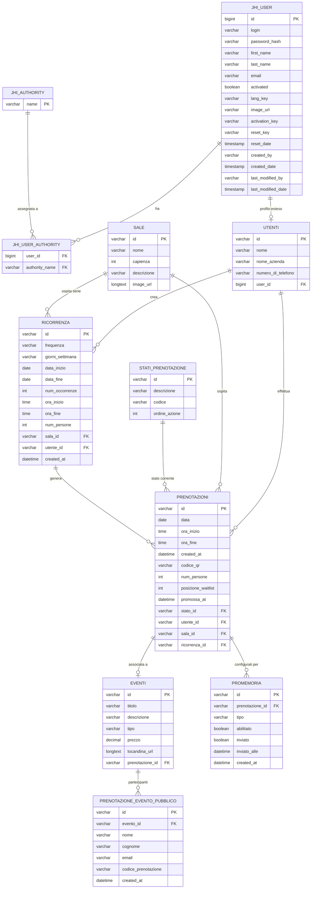

# Analisi Tecnica Backend — Boardroom

> **Generato il:** 2026-07-02  
> **Analisi basata su:** lettura diretta del codice sorgente (pom.xml, domain/, repository/, service/, web/rest/, config/, changelog Liquibase)

---

## 1. Struttura del progetto

### 1.1 Albero delle cartelle principali

```
boardroom/
├── pom.xml
├── src/
│   ├── main/
│   │   ├── java/main/
│   │   │   ├── BoardroomApp.java                    ← main class
│   │   │   ├── ApplicationWebXml.java
│   │   │   ├── GeneratedByJHipster.java
│   │   │   ├── aop/logging/
│   │   │   │   └── LoggingAspect.java               ← AOP logging su tutti i layer
│   │   │   ├── config/                              ← configurazioni Spring
│   │   │   │   ├── ApplicationProperties.java
│   │   │   │   ├── AsyncConfiguration.java
│   │   │   │   ├── Constants.java
│   │   │   │   ├── DatabaseConfiguration.java
│   │   │   │   ├── LiquibaseConfiguration.java
│   │   │   │   ├── SecurityJwtConfiguration.java
│   │   │   │   ├── WebConfigurer.java
│   │   │   │   └── ...
│   │   │   ├── domain/                              ← entità JPA
│   │   │   │   ├── AbstractAuditingEntity.java
│   │   │   │   ├── Authority.java
│   │   │   │   ├── User.java
│   │   │   │   ├── Utenti.java
│   │   │   │   ├── Sale.java
│   │   │   │   ├── StatiPrenotazione.java
│   │   │   │   ├── Prenotazioni.java
│   │   │   │   ├── Eventi.java
│   │   │   │   ├── PrenotazioneEventoPubblico.java
│   │   │   │   ├── Ricorrenza.java
│   │   │   │   ├── Promemoria.java
│   │   │   │   └── enumeration/
│   │   │   │       ├── TipoEvento.java
│   │   │   │       ├── StatoCodice.java
│   │   │   │       ├── Frequenza.java
│   │   │   │       └── TipoPromemoria.java
│   │   │   ├── management/
│   │   │   │   └── SecurityMetersService.java       ← metriche sicurezza
│   │   │   ├── repository/                          ← Spring Data JPA repositories
│   │   │   ├── security/                            ← utils, UserDetailsService, costanti ruoli
│   │   │   ├── service/                             ← logica di business
│   │   │   │   ├── dto/                             ← Data Transfer Objects
│   │   │   │   └── mapper/                          ← MapStruct mappers
│   │   │   └── web/
│   │   │       ├── filter/SpaWebFilter.java         ← SPA routing fallback
│   │   │       └── rest/                            ← REST controllers
│   │   │           ├── errors/                      ← eccezioni custom
│   │   │           └── vm/                          ← View Models (login, register)
│   │   └── resources/
│   │       ├── config/
│   │       │   ├── application.yml
│   │       │   ├── application-dev.yml
│   │       │   ├── application-prod.yml
│   │       │   ├── application-tls.yml
│   │       │   └── liquibase/
│   │       │       ├── master.xml
│   │       │       ├── changelog/                   ← 23 changeset XML
│   │       │       ├── data/                        ← seed CSV
│   │       │       └── fake-data/                   ← dati di test
│   │       ├── templates/mail/                      ← template Thymeleaf email
│   │       ├── swagger/api.yml
│   │       └── i18n/messages.properties
│   └── test/
│       └── java/main/
│           ├── config/                              ← config di test
│           ├── cucumber/                            ← BDD test
│           ├── domain/                              ← test entità
│           ├── security/                            ← test JWT
│           ├── service/                             ← test servizi
│           └── web/rest/                            ← integration test REST
└── src/main/docker/
    ├── app.yml                                      ← compose: app + mysql
    ├── mysql.yml                                    ← MySQL 9.2.0
    └── monitoring.yml, prometheus.yml, grafana/...
```

### 1.2 Convenzioni di packaging

Il package radice è `main` (inusuale — generalmente si usa `com.nomeprogetto`). Le convenzioni JHipster standard sono rispettate:

| Package                | Contenuto                                               |
| ---------------------- | ------------------------------------------------------- |
| `main.domain`          | Entità JPA + enum                                       |
| `main.repository`      | Interfacce Spring Data JPA                              |
| `main.service`         | Logica di business (`@Service`)                         |
| `main.service.dto`     | Data Transfer Objects                                   |
| `main.service.mapper`  | MapStruct mapper (entity ↔ DTO)                        |
| `main.web.rest`        | REST controller (`@RestController`)                     |
| `main.web.rest.errors` | Eccezioni e gestione errori                             |
| `main.web.rest.vm`     | View Models (login, register)                           |
| `main.config`          | Configurazione Spring (bean, security, Liquibase, ecc.) |
| `main.security`        | Costanti ruoli, UserDetailsService, utility             |
| `main.aop.logging`     | Aspect per logging                                      |
| `main.management`      | Metriche (Micrometer)                                   |

### 1.3 Build system e dipendenze principali

**Build system:** Maven (pom.xml)  
**Classe principale:** `main.BoardroomApp`

| Libreria                  | Versione                     |
| ------------------------- | ---------------------------- |
| Spring Boot               | **3.4.5**                    |
| Java                      | **17**                       |
| JHipster Framework        | 8.11.0                       |
| MapStruct                 | 1.6.3                        |
| Liquibase                 | (gestita da Spring Boot BOM) |
| SpringDoc OpenAPI         | 2.8.8                        |
| jackson-databind-nullable | 0.2.6                        |
| Google ZXing (QR code)    | 3.5.1                        |
| ArchUnit JUnit5           | 1.4.0                        |
| Cucumber                  | 7.22.1                       |
| Testcontainers            | (gestita da Spring Boot BOM) |
| JaCoCo                    | 0.8.13                       |
| Jib (Docker image)        | 3.4.5                        |
| Node.js (frontend)        | v22.15.0                     |
| npm                       | 11.3.0                       |

**Dipendenze Spring Boot principali:**

- `spring-boot-starter-data-jpa` — ORM via Hibernate 6
- `spring-boot-starter-security` — Spring Security
- `spring-boot-starter-oauth2-resource-server` — JWT (Resource Server)
- `spring-boot-starter-mail` — invio email
- `spring-boot-starter-thymeleaf` — template email
- `spring-boot-starter-web` (server: Undertow, non Tomcat)
- `spring-boot-starter-cache` + `ehcache` — cache locale
- `spring-boot-starter-actuator` — health, metrics
- `spring-boot-starter-validation` — Jakarta Bean Validation
- `spring-boot-starter-aop` — AOP
- `HikariCP` — connection pool
- `spring-security-data` — integrazione sicurezza/JPA

---

## 2. Stack tecnologico

### 2.1 Java e Spring Boot

- **Java 17** (LTS)
- **Spring Boot 3.4.5** (basato su Spring Framework 6)

### 2.2 Framework e librerie

| Area                | Tecnologia                                       |
| ------------------- | ------------------------------------------------ |
| ORM                 | Spring Data JPA + Hibernate 6                    |
| Migrazione schema   | **Liquibase** (XML changelog)                    |
| Mapping entità↔DTO | **MapStruct 1.6.3**                              |
| Validazione         | Jakarta Bean Validation (Hibernate Validator)    |
| Cache               | **Ehcache** (javax.cache API)                    |
| Email               | Spring Mail + **Thymeleaf** (template HTML)      |
| QR code             | **Google ZXing 3.5.1**                           |
| API docs            | **SpringDoc OpenAPI 2.8.8** (profilo `api-docs`) |
| Metriche            | **Micrometer** + Prometheus                      |
| Server HTTP         | **Undertow** (Servlet container, no Tomcat)      |
| Connection pool     | **HikariCP**                                     |
| JSON                | Jackson (con moduli hibernate6, jsr310)          |
| Logging             | Logback + SLF4J                                  |

### 2.3 Database

| Ambiente        | Database                  | URL                                                                    |
| --------------- | ------------------------- | ---------------------------------------------------------------------- |
| **Dev**         | H2 (file, modalità MySQL) | `jdbc:h2:file:./target/h2db/db/boardroom;DB_CLOSE_DELAY=-1;MODE=MYSQL` |
| **Prod**        | MySQL 9.2.0               | `jdbc:mysql://localhost:3306/boardroom`                                |
| **Test (prod)** | MySQL via Testcontainers  | avviato automaticamente                                                |

Il profilo **dev** utilizza H2 in modalità MySQL per compatibilità con i changelog Liquibase. Sono però presenti **query native MySQL-specifiche** (HOUR, DAYOFWEEK, YEAR, MONTH) in `StatsRepository` che non funzionano su H2.

**Motore di migrazione schema:** Liquibase (configurazione in `src/main/resources/config/liquibase/`).  
DDL auto: `ddl-auto: none` — Hibernate non tocca mai lo schema, solo Liquibase lo gestisce.

### 2.4 Containerizzazione

**Docker Compose** (`src/main/docker/`):

- `app.yml`: servizio `app` (immagine `boardroom`) + `mysql` (MySQL 9.2.0, porta host 3307 → 3306 interna). L'app dipende dal `mysql` con healthcheck. Profilo attivo: `prod,api-docs`.
- `mysql.yml`: MySQL 9.2.0, database `boardroom`, `lower_case_table_names=1`, `utf8mb4`.

**Docker image:** costruita con **Jib Maven Plugin 3.4.5** (immagine base: `eclipse-temurin:17-jre-focal`, porta 8080, utente UID 1000, entrypoint `/entrypoint.sh`).

Spring Boot Docker Compose è abilitato in produzione e disabilitato in sviluppo.

### 2.5 Autenticazione e autorizzazione

**Meccanismo:** JWT stateless via **Spring Security OAuth2 Resource Server**

- Algoritmo: **HMAC-SHA256 (HS256)** — `NimbusJwtDecoder/Encoder`
- Chiave: Base64-encoded secret (`jhipster.security.authentication.jwt.base64-secret`)
- Scadenza: **86400 secondi (24 ore)**; "remember me": **2592000 secondi (30 giorni)**
- Claim aggiuntivi: `auth` (lista autorità), `userId`
- Login: `POST /api/authenticate` → restituisce `{id_token: "..."}`

**Ruoli applicativi** (definiti in `AuthoritiesConstants`):

| Costante    | Valore           |
| ----------- | ---------------- |
| `ADMIN`     | `ROLE_ADMIN`     |
| `USER`      | `ROLE_USER`      |
| `ANONYMOUS` | `ROLE_ANONYMOUS` |

---

## 3. Entità e modello dati

### 3.1 AbstractAuditingEntity

Classe astratta (`@MappedSuperclass`) estesa solo da `User`. Fornisce:

- `createdBy` (VARCHAR 50, updatable=false)
- `createdDate` (TIMESTAMP, updatable=false)
- `lastModifiedBy` (VARCHAR 50)
- `lastModifiedDate` (TIMESTAMP)

Alimentata da `AuditingEntityListener` + `SpringSecurityAuditorAware`.

---

### 3.2 User — tabella `jhi_user`

| Campo         | Tipo Java        | Colonna DB                      | Vincoli                                               |
| ------------- | ---------------- | ------------------------------- | ----------------------------------------------------- |
| id            | Long             | id                              | PK, IDENTITY                                          |
| login         | String           | login                           | NOT NULL, UNIQUE, max 50, regex `[a-z0-9._@+-]{1,50}` |
| password      | String           | password_hash                   | NOT NULL, 60 chars (bcrypt), `@JsonIgnore`            |
| firstName     | String           | first_name                      | max 50                                                |
| lastName      | String           | last_name                       | max 50                                                |
| email         | String           | email                           | UNIQUE, 5–254 chars                                   |
| activated     | boolean          | activated                       | NOT NULL, default false                               |
| langKey       | String           | lang_key                        | 2–10 chars                                            |
| imageUrl      | String           | image_url                       | max 256                                               |
| activationKey | String           | activation_key                  | max 20, `@JsonIgnore`                                 |
| resetKey      | String           | reset_key                       | max 20, `@JsonIgnore`                                 |
| resetDate     | Instant          | reset_date                      | nullable                                              |
| authorities   | Set\<Authority\> | jhi_user_authority (join table) | ManyToMany, `@JsonIgnore`                             |

Estende `AbstractAuditingEntity<Long>`.

---

### 3.3 Authority — tabella `jhi_authority`

| Campo | Tipo Java | Vincoli              |
| ----- | --------- | -------------------- |
| name  | String    | PK, NOT NULL, max 50 |

Valori seed: `ROLE_ADMIN`, `ROLE_USER`.

---

### 3.4 Utenti — tabella `utenti`

Profilo esteso dell'utente applicativo (1:1 con `User`).

| Campo            | Tipo Java | Colonna DB         | Vincoli                     |
| ---------------- | --------- | ------------------ | --------------------------- |
| id               | UUID      | id                 | PK, VARCHAR(36)             |
| nome             | String    | nome               | NOT NULL                    |
| nomeAzienda      | String    | nome_azienda       | nullable                    |
| numeroDiTelefono | String    | numero_di_telefono | NOT NULL                    |
| user             | User      | user_id            | FK → jhi_user, UNIQUE, LAZY |

---

### 3.5 Sale — tabella `sale`

| Campo         | Tipo Java           | Colonna DB  | Vincoli                              |
| ------------- | ------------------- | ----------- | ------------------------------------ |
| id            | UUID                | id          | PK, VARCHAR(36)                      |
| nome          | String              | nome        | NOT NULL                             |
| capienza      | Integer             | capienza    | NOT NULL                             |
| descrizione   | String              | descrizione | nullable                             |
| imageUrl      | String              | image_url   | LONGTEXT, nullable (Base64 data URL) |
| prenotazionis | Set\<Prenotazioni\> | —           | OneToMany LAZY, mappedBy `sala`      |

---

### 3.6 StatiPrenotazione — tabella `stati_prenotazione`

| Campo        | Tipo Java   | Colonna DB    | Vincoli                   |
| ------------ | ----------- | ------------- | ------------------------- |
| id           | UUID        | id            | PK, VARCHAR(36)           |
| descrizione  | String      | descrizione   | NOT NULL                  |
| codice       | StatoCodice | codice        | NOT NULL, EnumType.STRING |
| ordineAzione | Integer     | ordine_azione | NOT NULL                  |

**Enum StatoCodice** (valori possibili):

| Valore     | Significato                                  | ordine |
| ---------- | -------------------------------------------- | ------ |
| WAITING    | In attesa di conferma (5 min timeout)        | 1      |
| CONFIRMED  | Confermata                                   | 2      |
| REJECTED   | Scaduta senza conferma                       | 3      |
| CANCELLED  | Annullata dall'utente                        | 4      |
| WAITLISTED | In lista di attesa slot occupato             | 5      |
| PROMOTED   | Promossa da waitlist (15 min per confermare) | 6      |
| EXPIRED    | Scaduta dopo promozione senza conferma       | 7      |

---

### 3.7 Prenotazioni — tabella `prenotazioni`

| Campo             | Tipo Java         | Colonna DB         | Vincoli                                               |
| ----------------- | ----------------- | ------------------ | ----------------------------------------------------- |
| id                | UUID              | id                 | PK, VARCHAR(36)                                       |
| data              | LocalDate         | data               | NOT NULL                                              |
| oraInizio         | LocalTime         | ora_inizio         | NOT NULL                                              |
| oraFine           | LocalTime         | ora_fine           | NOT NULL                                              |
| createdAt         | LocalDateTime     | created_at         | NOT NULL, updatable=false (@CreatedDate)              |
| codiceQr          | String            | codice_qr          | UNIQUE, nullable                                      |
| numPersone        | Integer           | num_persone        | nullable                                              |
| posizioneWaitlist | Integer           | posizione_waitlist | nullable (null = non in waitlist)                     |
| promossaAt        | LocalDateTime     | promossa_at        | nullable (timestamp promozione waitlist)              |
| stato             | StatiPrenotazione | stato_id           | FK ManyToOne LAZY                                     |
| utente            | Utenti            | utente_id          | FK ManyToOne LAZY                                     |
| sala              | Sale              | sala_id            | FK ManyToOne LAZY                                     |
| ricorrenza        | Ricorrenza        | ricorrenza_id      | FK ManyToOne LAZY, nullable                           |
| evento            | Eventi            | —                  | OneToOne LAZY, mappedBy `prenotazione` (lato inverso) |

---

### 3.8 Eventi — tabella `eventi`

| Campo        | Tipo Java    | Colonna DB      | Vincoli                                                                                                  |
| ------------ | ------------ | --------------- | -------------------------------------------------------------------------------------------------------- |
| id           | UUID         | id              | PK, VARCHAR(36)                                                                                          |
| titolo       | String       | titolo          | NOT NULL                                                                                                 |
| descrizione  | String       | descrizione     | NOT NULL (annotazione `@Column`, assenza di `nullable=false` nella dichiarazione ma il valore è marcato) |
| tipo         | TipoEvento   | tipo            | NOT NULL, EnumType.STRING                                                                                |
| prezzo       | BigDecimal   | prezzo          | precision 21, scale 2, nullable                                                                          |
| locandinaUrl | String       | locandina_url   | LONGTEXT, nullable (Base64 data URL)                                                                     |
| prenotazione | Prenotazioni | prenotazione_id | FK OneToOne LAZY (lato proprietario)                                                                     |

**Enum TipoEvento:** `PRIVATO`, `PUBBLICO`

Regola di business: se `tipo == PRIVATO` → `prezzo` viene impostato a `BigDecimal.ZERO`.

---

### 3.9 PrenotazioneEventoPubblico — tabella `prenotazione_evento_pubblico`

Traccia le registrazioni dei partecipanti agli eventi pubblici (una riga per partecipante).

| Campo              | Tipo Java     | Colonna DB          | Vincoli                                  |
| ------------------ | ------------- | ------------------- | ---------------------------------------- |
| id                 | UUID          | id                  | PK, VARCHAR(36)                          |
| evento             | Eventi        | evento_id           | FK ManyToOne LAZY, NOT NULL              |
| nome               | String        | nome                | NOT NULL                                 |
| cognome            | String        | cognome             | NOT NULL                                 |
| email              | String        | email               | NOT NULL                                 |
| codicePrenotazione | String        | codice_prenotazione | NOT NULL, UNIQUE                         |
| createdAt          | LocalDateTime | created_at          | NOT NULL, updatable=false (@CreatedDate) |

---

### 3.10 Ricorrenza — tabella `ricorrenza`

Regola di ripetizione per serie di prenotazioni. Strategia EAGER: tutte le occorrenze vengono generate immediatamente alla creazione.

| Campo           | Tipo Java            | Colonna DB       | Vincoli                                          |
| --------------- | -------------------- | ---------------- | ------------------------------------------------ |
| id              | UUID                 | id               | PK, VARCHAR(36)                                  |
| frequenza       | Frequenza            | frequenza        | NOT NULL, VARCHAR(20)                            |
| giorniSettimana | String               | giorni_settimana | VARCHAR(100), nullable (CSV: "MONDAY,WEDNESDAY") |
| dataInizio      | LocalDate            | data_inizio      | NOT NULL                                         |
| dataFine        | LocalDate            | data_fine        | nullable (esclusivo con numOccorrenze)           |
| numOccorrenze   | Integer              | num_occorrenze   | nullable (esclusivo con dataFine)                |
| oraInizio       | LocalTime            | ora_inizio       | NOT NULL                                         |
| oraFine         | LocalTime            | ora_fine         | NOT NULL                                         |
| numPersone      | Integer              | num_persone      | nullable                                         |
| sala            | Sale                 | sala_id          | FK ManyToOne LAZY, NOT NULL                      |
| utente          | Utenti               | utente_id        | FK ManyToOne LAZY, NOT NULL                      |
| istanze         | List\<Prenotazioni\> | —                | OneToMany LAZY, mappedBy `ricorrenza`            |
| createdAt       | LocalDateTime        | created_at       | NOT NULL, updatable=false                        |

**Enum Frequenza:** `WEEKLY` (ogni settimana), `BIWEEKLY` (ogni 2 settimane), `MONTHLY` (stesso giorno del mese)

---

### 3.11 Promemoria — tabella `promemoria`

Configurazione promemoria email per singola prenotazione. Un record = un tipo di promemoria attivato.

| Campo        | Tipo Java      | Colonna DB      | Vincoli                                     |
| ------------ | -------------- | --------------- | ------------------------------------------- |
| id           | UUID           | id              | PK, VARCHAR(36)                             |
| prenotazione | Prenotazioni   | prenotazione_id | FK ManyToOne LAZY, NOT NULL, CASCADE DELETE |
| tipo         | TipoPromemoria | tipo            | NOT NULL, VARCHAR(30)                       |
| abilitato    | boolean        | abilitato       | NOT NULL, default true                      |
| inviato      | boolean        | inviato         | NOT NULL, default false (anti-duplicati)    |
| inviatoAlle  | LocalDateTime  | inviato_alle    | nullable (audit timestamp)                  |
| createdAt    | LocalDateTime  | created_at      | NOT NULL, updatable=false                   |

**Unique constraint:** `(prenotazione_id, tipo)` — impossibile duplicare lo stesso tipo per la stessa prenotazione.

**Enum TipoPromemoria:**

| Valore          | Giorni prima      |
| --------------- | ----------------- |
| WEEK_BEFORE     | 7                 |
| TWO_DAYS_BEFORE | 2                 |
| DAY_BEFORE      | 1                 |
| SAME_DAY        | 0 (stesso giorno) |

---

### 3.12 Diagramma ER (Mermaid)



---

## 4. Livello di persistenza

### 4.1 Repository Spring Data

#### `UserRepository` (JpaRepository\<User, Long\>)

- `findOneByActivationKey(String)` — attivazione account
- `findAllByActivatedIsFalseAndActivationKeyIsNotNullAndCreatedDateBefore(Instant)` — pulizia utenti non attivati
- `findOneByResetKey(String)` — reset password
- `findOneByEmailIgnoreCase(String)` — lookup per email
- `findOneByLogin(String)` — lookup per login
- `findOneWithAuthoritiesByLogin(String)` — con `@EntityGraph("authorities")` + `@Cacheable("usersByLogin")`
- `findOneWithAuthoritiesByEmailIgnoreCase(String)` — con `@Cacheable("usersByEmail")`
- `findAllByIdNotNullAndActivatedIsTrue(Pageable)` — lista utenti pubblici

#### `UtentiRepository` (JpaRepository\<Utenti, UUID\>)

- `findByUser_Login(String)` — lookup profilo per login (usato in ogni operazione autenticata)

#### `SaleRepository` (JpaRepository\<Sale, UUID\>)

- `findByIdWithLock(UUID)` — `PESSIMISTIC_WRITE` lock (anti race condition nelle prenotazioni)
- `findFreeSales(LocalDate, LocalTime, LocalTime, Integer)` — anti-join JPQL: trova sale senza prenotazioni CONFIRMED/WAITING nel slot richiesto
- `findAllCached()` — lista ordinata per nome, `@Cacheable("sale-list")`

#### `StatiPrenotazioneRepository` (JpaRepository\<StatiPrenotazione, UUID\>)

- `findByCodice(StatoCodice)` — lookup per codice enum, `@Cacheable` per key = codice

#### `PrenotazioniRepository` (JpaRepository\<Prenotazioni, UUID\>)

Query JPQL rilevanti:

- `existsOverlappingConfirmedPrenotazione(Sale, LocalDate, LocalTime, LocalTime)` — verifica sovrapposizione di fasce orarie con prenotazioni CONFIRMED (logica: `oraInizio < oraFine AND oraFine > oraInizio`)
- `existsOverlappingConfirmedExcluding(...)` — come sopra ma esclude una prenotazione (usato in update)
- `findStorico(LocalDate)` — prenotazioni passate con join fetch completo
- `findStoricoByLogin(String, LocalDate)` — stesso, filtrato per utente
- `findByUtente_User_LoginAndDataGreaterThanEqualOrderByDataAscOraInizioAsc(String, LocalDate)` — prenotazioni future dell'utente
- `findExpiredWaiting(StatoCodice, LocalDateTime)` — WAITING create più di X minuti fa
- `aggiornaScadute(StatiPrenotazione, LocalDateTime)` — `@Modifying` bulk update WAITING→REJECTED
- `findByCodiceQr(String)` — lookup per QR code
- `findByDataBetween(LocalDate, LocalDate)` — vista calendario
- `findByRicorrenzaId(UUID)` — tutte le istanze di una serie
- `findByRicorrenzaIdAndDataGreaterThanEqual(UUID, LocalDate)` — istanze future (per cancellazione parziale)
- `existsWaitlistPerStessoSlot(Sale, LocalDate, LocalTime, LocalTime, Utenti)` — anti-duplicati waitlist
- `maxPosizioneWaitlist(Sale, LocalDate, LocalTime, LocalTime)` — posizione massima corrente
- `findWaitlistOrdinata(Sale, LocalDate, LocalTime, LocalTime)` — waitlist FIFO
- `findPromotedScadute(LocalDateTime)` — PROMOTED con timer scaduto

#### `EventiRepository` (JpaRepository\<Eventi, UUID\>)

- `findPublicConfirmed(TipoEvento, StatoCodice, LocalDate)` — eventi pubblici con prenotazione CONFIRMED non passata
- `findByIdWithPrenotazioneAndSala(UUID)` — join fetch prenotazione + sala
- `findByIdWithLock(UUID)` — `PESSIMISTIC_WRITE` lock

#### `PrenotazioneEventoPubblicoRepository` (JpaRepository\<..., UUID\>)

- `countByEventoId(UUID)` — conta partecipanti di un evento
- `countByEventoIdIn(List<UUID>)` — batch count (anti N+1)
- `conteggioPerEventi(List<UUID>)` — metodo default che restituisce `Map<UUID, Long>`
- `nextSequenzaPerEvento(UUID)` — numero sequenziale prossimo partecipante

#### `RicorrenzaRepository` (JpaRepository\<Ricorrenza, UUID\>)

- `findByUtente_User_Login(String)` — serie dell'utente autenticato
- `findAllWithDetails()` — tutte le serie con join fetch sala + utente (admin)

#### `PromemoriaRepository` (JpaRepository\<Promemoria, UUID\>)

- `findDaInviareOggi(LocalDate, LocalDate, LocalDate, LocalDate)` — query principale dello scheduler con join fetch completo (prenotazione, sala, stato, utente, user, evento)
- `findByPrenotazioneId(UUID)` — tutti i promemoria di una prenotazione
- `findByPrenotazioneIdAndTipo(UUID, TipoPromemoria)` — upsert
- `findByPrenotazioneIdAndAbilitatoTrue(UUID)` — promemoria attivi

#### `StatsRepository` (JpaRepository\<Prenotazioni, UUID\>)

Separato da `PrenotazioniRepository` per separazione delle responsabilità. Contiene solo query aggregate:

- `countTotale(LocalDate, LocalDate)` — JPQL
- `countConfermate(LocalDate, LocalDate)` — JPQL
- `countUtentiAttivi(LocalDate, LocalDate)` — `COUNT(DISTINCT utente.id)` JPQL
- `countPerSala(LocalDate, LocalDate)` — `GROUP BY sala.nome` JPQL
- `countPerOra(LocalDate, LocalDate)` — `HOUR(ora_inizio)` **native MySQL**
- `occupazionePerMese(LocalDate, LocalDate)` — `YEAR/MONTH` + JOIN **native MySQL**
- `top5Utenti(LocalDate, LocalDate)` — `GROUP BY utente.nome ORDER BY COUNT DESC` JPQL
- `countPerGiornoSettimana(LocalDate, LocalDate)` — `DAYOFWEEK(data)` **native MySQL**

---

### 4.2 Changelog Liquibase — cronologia migrazioni

| Timestamp      | File                                         | Cosa introduce                                                                                                                |
| -------------- | -------------------------------------------- | ----------------------------------------------------------------------------------------------------------------------------- |
| 00000000000000 | `_initial_schema.xml`                        | Schema JHipster base: tabelle `jhi_user`, `jhi_authority`, `jhi_user_authority`                                               |
| 20260121111208 | `_added_entity_Sale.xml`                     | Crea tabella `sale` (id, nome, capienza, descrizione) + fake-data                                                             |
| 20260121111209 | `_added_entity_Utenti.xml`                   | Crea tabella `utenti` (id, nome, nome_azienda, numero_di_telefono) + fake-data                                                |
| 20260121111209 | `_added_entity_constraints_Utenti.xml`       | FK `utenti.user_id` → `jhi_user.id`                                                                                           |
| 20260121111210 | `_added_entity_StatiPrenotazione.xml`        | Crea tabella `stati_prenotazione` (id, descrizione, codice, ordine_azione) + fake-data                                        |
| 20260121111210 | `_seed_stati_prenotazione.xml`               | Seed iniziale stati: WAITING, CONFIRMED, REJECTED, CANCELLED                                                                  |
| 20260121111211 | `_added_entity_Prenotazioni.xml`             | Crea tabella `prenotazioni` (id, data, ora_inizio, ora_fine) + fake-data                                                      |
| 20260121111211 | `_added_entity_constraints_Prenotazioni.xml` | FK `prenotazioni.stato_id`, `utente_id`, `sala_id`                                                                            |
| 20260121111212 | `_added_entity_Eventi.xml`                   | Crea tabella `eventi` (id, titolo, tipo, prezzo) + fake-data                                                                  |
| 20260121111212 | `_added_entity_constraints_Eventi.xml`       | FK `eventi.prenotazione_id` → `prenotazioni.id`                                                                               |
| 20260205       | `_added_created_at_to_prenotazioni.xml`      | Aggiunge colonna `created_at` a `prenotazioni`                                                                                |
| 20260216       | `_add_descrizione_to_eventi.xml`             | Aggiunge `descrizione` (LONGTEXT) a `eventi`                                                                                  |
| 20260302000001 | `_added_indexes_prenotazioni.xml`            | Indici su `prenotazioni.data`, `sala_id`, `stato_id`                                                                          |
| 20260302000002 | `_added_codice_qr_to_prenotazioni.xml`       | Aggiunge `codice_qr` (UNIQUE) a `prenotazioni`                                                                                |
| 20260303000001 | `_add_num_persone_to_prenotazioni.xml`       | Aggiunge `num_persone` a `prenotazioni`                                                                                       |
| 20260304000002 | `_create_prenotazione_evento_pubblico.xml`   | Crea tabella `prenotazione_evento_pubblico`                                                                                   |
| 20260330000001 | `_create_ricorrenza.xml`                     | Crea tabella `ricorrenza`; aggiunge FK `ricorrenza_id` a `prenotazioni`; indice su `prenotazioni.ricorrenza_id`               |
| 20260401000001 | `_create_promemoria.xml`                     | Crea tabella `promemoria` + FK → prenotazioni (CASCADE DELETE) + unique (prenotazione_id, tipo) + indice (inviato, abilitato) |
| 20260401100001 | `_add_perf_indexes.xml`                      | Indici composti per ottimizzare `findFreeSales` (anti-join)                                                                   |
| 20260402000001 | `_add_image_url_to_sale.xml`                 | Aggiunge `image_url` (VARCHAR) a `sale`                                                                                       |
| 20260402000002 | `_alter_image_url_to_longtext.xml`           | Modifica `sale.image_url` da VARCHAR a LONGTEXT (per Base64)                                                                  |
| 20260402000003 | `_add_locandina_to_eventi.xml`               | Aggiunge `locandina_url` (LONGTEXT) a `eventi`                                                                                |
| 20260402000004 | `_add_waitlist.xml`                          | Aggiunge `posizione_waitlist`, `promossa_at` a `prenotazioni`; seed stati WAITLISTED, PROMOTED, EXPIRED                       |

---

## 5. Logica di business

### 5.1 UserService

**Responsabilità:** ciclo vita account JHipster (registrazione, attivazione, reset password, gestione admin).

Metodi pubblici principali:

- `activateRegistration(String key)` — attiva account via chiave
- `completePasswordReset(String newPassword, String key)` — reset con validazione scadenza (24 ore)
- `requestPasswordReset(String mail)` — genera reset key
- `registerUser(AdminUserDTO, String password)` — registrazione self-service; utente attivato immediatamente (`setActivated(true)`) con ruolo `ROLE_USER`
- `createUser(AdminUserDTO)` — creazione da admin con assegnazione ruoli
- `updateUser(AdminUserDTO)` — aggiornamento completo da admin
- `updateUser(firstName, lastName, email, langKey, imageUrl)` — aggiornamento self-service
- `changePassword(String current, String new)` — con verifica password corrente
- `getAllManagedUsers(Pageable)` / `getAllPublicUsers(Pageable)`
- `removeNotActivatedUsers()` — **@Scheduled** cron `0 0 1 * * ?` (ore 01:00): elimina utenti non attivati con chiave e creati più di 3 giorni fa

Cache invalidata su ogni modifica tramite `CacheManager.evictIfPresent` sui cache `usersByLogin` e `usersByEmail`.

### 5.2 UtentiService

**Responsabilità:** CRUD del profilo esteso `Utenti`. Operazioni standard: `save`, `update`, `partialUpdate`, `findAll`, `findOne(UUID)`, `delete(UUID)`.

### 5.3 PrenotazioniService

**Responsabilità:** gestione completa del ciclo di vita delle prenotazioni.

Metodi principali e regole di business:

**`save(PrenotazioniDTO)` (admin):**

- Acquisisce PESSIMISTIC_WRITE lock sulla sala
- Imposta stato CONFIRMED di default
- Verifica assenza sovrapposizioni con prenotazioni CONFIRMED esistenti
- Genera codice QR alfanumerico se assente

**`nuovoPrenotazioni(PrenotazioniDTO)` (utente):**

- Valida input (salaId, data, oraInizio, oraFine)
- Acquisisce PESSIMISTIC_WRITE lock sulla sala
- Risolve l'utente autenticato da SecurityContext → `Utenti`
- Valida: `oraInizio < oraFine`, `data >= oggi`, `numPersone <= capienza sala`
- Imposta stato iniziale `WAITING`
- Se esiste sovrapposizione CONFIRMED → delega a `WaitlistService.aggiungiAWaitlist()`

**`confermaPrenotazione(UUID)` (WAITING → CONFIRMED):**

- Verifica che il richiedente sia il proprietario oppure ADMIN
- Controlla stato = WAITING
- Acquisisce PESSIMISTIC_WRITE lock sulla sala
- Verifica assenza conflitti
- Genera QR se assente
- Invia email di conferma con QR allegato (via `MailService`)

**`deletePrenotazione(UUID)` (logico, proprietario):**

- Verifica proprietà
- Imposta stato CANCELLED
- Se era CONFIRMED → `WaitlistService.promuoviDaWaitlist()` per liberare lo slot ai successivi in coda

**`deleteAsAdmin(UUID)` (fisico, ADMIN):**

- Cancellazione definitiva dal DB

**`aggiornaPrenotazioniScadute()` — @Scheduled(fixedRate=60000):**

- Aggiorna WAITING → REJECTED per prenotazioni create più di 5 minuti fa
- Bulk update via `@Modifying`

**`findByDataBetween(LocalDate, LocalDate)` (calendario):**

- Admin: tutte le prenotazioni nell'intervallo
- Utente: solo le proprie (filtro in memoria dopo la query)

### 5.4 EventiService

**Responsabilità:** gestione eventi (privati e pubblici) e registrazione partecipanti.

Metodi principali:

**`createEvento(EventiDTO)`:**

- Se prenotazioneId fornita: carica la prenotazione e la collega all'evento
- Imposta prezzo a ZERO se tipo = PRIVATO
- Dopo salvataggio: aggiorna stato prenotazione a CONFIRMED + invia email conferma con QR

**`findPublicEventi()`:**

- Solo eventi PUBBLICI con prenotazione CONFIRMED e data futura
- Usa `conteggioPerEventi()` (una sola query batch) per evitare N+1 nel calcolo `postiOccupati`/`eventoPieno`

**`inviaEmailPrenotazione(UUID, PrenotazioniEmailDTO)` (registrazione evento pubblico):**

- Verifica capienza (conta `PrenotazioneEventoPubblico`)
- Se pieno → lancia `EventoPienoException` (HTTP 409)
- Genera codice: `{8 char eventoId}-{inizialeNome}{sequenza02d}` (es: `AB12CD34-A01`)
- Salva `PrenotazioneEventoPubblico`
- Genera QR e invia email biglietto

**`isCurrentUserOwner(UUID eventoId)`:**

- Verifica che `evento.prenotazione.utente.user.login == currentUserLogin`

**`update(EventiDTO)` / `partialUpdate(EventiDTO)`:**

- Preserva il tipo dal DB se il frontend non lo invia
- Forza prezzo a ZERO se PRIVATO

### 5.5 WaitlistService

**Responsabilità:** gestione lista di attesa (waitlist) per slot prenotazione occupati.

**`aggiungiAWaitlist(Prenotazioni)`:**

- Verifica che l'utente non sia già in coda per lo stesso slot (`existsWaitlistPerStessoSlot`)
- Calcola posizione = `maxPosizioneWaitlist + 1`
- Imposta stato `WAITLISTED` + `posizioneWaitlist`
- Invia email di notifica all'utente con la sua posizione

**`promuoviDaWaitlist(Prenotazioni prenotazioneCancellata)`:**

- Acquisisce lock sulla sala
- Recupera waitlist FIFO (`findWaitlistOrdinata`)
- Promuove il primo: stato → `PROMOTED`, `promossaAt = now()`, genera QR, invia email con link di conferma e countdown 15 min
- Ricalcola posizioni per tutti i restanti in coda

**`confermaPromozione(UUID)`:**

- Verifica stato = PROMOTED
- Verifica che non siano passati più di 15 minuti da `promossaAt`
- Verifica assenza conflitti (slot ancora libero)
- Se tutto ok: PROMOTED → CONFIRMED
- Se scaduto: `scadiEPromuoviSuccessivo()` → EXPIRED + promuovi il prossimo

**`scadiPromozioniScadute()` — @Scheduled(fixedRate=60_000):**

- Cerca prenotazioni PROMOTED con `promossaAt <= now - 15 min`
- Le scade e promuove il prossimo in coda

### 5.6 RicorrenzaService

**Responsabilità:** prenotazioni ricorrenti (serie ripetute settimanalmente, bisettimanalmente o mensilmente).

**`creaRicorrenza(RicorrenzaDTO)`:**

1. Valida input (sala obbligatoria, frequenza, data inizio, oraInizio < oraFine, dataInizio non nel passato, giorniSettimana obbligatori per WEEKLY/BIWEEKLY)
2. Acquisisce PESSIMISTIC_WRITE lock sulla sala
3. Salva la regola `Ricorrenza`
4. Calcola tutte le date candidate via `calcolaDate()` (max 365 occorrenze)
5. Per ogni data: verifica conflitti → se free, crea `Prenotazioni` (CONFIRMED) + `Eventi` (PRIVATO con titolo/descrizione)
6. Restituisce DTO con contatori `istanzeCreate`, `istanzeConflitto`, `dateConflitto` (max 10 date mostrate)

**`calcolaDate(RicorrenzaDTO)`:**

- WEEKLY: itera settimane dal lunedì precedente a dataInizio, include tutti i giorni selezionati in `giorniSettimana`
- BIWEEKLY: come WEEKLY ma avanza di 2 settimane
- MONTHLY: itera mesi aggiungendo 1 mese a `dataInizio`

**`cancellaSerieDaOggi(UUID)` / `cancellaTuttaSerie(UUID)`:**

- Verifica che il richiedente sia proprietario o ADMIN
- Imposta stato → CANCELLED su tutte le prenotazioni future (o tutte) della serie

### 5.7 PromemoriaService

**Responsabilità:** configurazione dei promemoria email per prenotazione.

**`salvaPromemoria(PromemoriaDTO)`:**

- Verifica proprietà (owner-check + admin bypass)
- Strategia upsert per tutti e 4 i tipi (`TipoPromemoria.values()`)
- Se un tipo viene riabilitato dopo essere già stato inviato → reset `inviato=false, inviatoAlle=null` per permettere reinvio

**`getPromemoria(UUID)`:**

- Costruisce riepilogo di tutti e 4 i tipi con stato `abilitato`/`inviato`

### 5.8 ReminderSchedulerService

**Responsabilità:** invio giornaliero dei promemoria email.

**`inviaPromemoriaGiornalieri()` — @Scheduled(cron="0 0 8 \* \* \*"):**

1. Calcola le 4 date target in Java: `oggi`, `oggi+1`, `oggi+2`, `oggi+7`
2. Chiama `PromemoriaRepository.findDaInviareOggi(...)` (una sola query con join fetch completo)
3. Per ogni promemoria: costruisce variabili template (nome utente, sala, titolo evento, etichetta tipo) e chiama `MailService.sendPromemoriaPrenotazione()`
4. Segna `inviato=true`, `inviatoAlle=now()` (anti-duplicati)
5. Continua anche in caso di errore su singolo promemoria

### 5.9 StatsDashboardService

**Responsabilità:** KPI e grafici per la dashboard admin.

**`getDashboard(LocalDate dal, LocalDate al)` — @PreAuthorize(ADMIN):**

| KPI/Grafico             | Query                                               |
| ----------------------- | --------------------------------------------------- |
| Totale prenotazioni     | `StatsRepository.countTotale` (JPQL)                |
| Prenotazioni confermate | `countConfermate` (JPQL)                            |
| Utenti attivi           | `countUtentiAttivi` (JPQL, COUNT DISTINCT)          |
| Tasso occupazione %     | `(confermate/totale) * 100` in Java                 |
| Prenotazioni per sala   | `countPerSala` (JPQL, GROUP BY)                     |
| Ore più richieste       | `countPerOra` (native MySQL, HOUR)                  |
| Occupazione per mese    | `occupazionePerMese` (native MySQL, YEAR/MONTH)     |
| Top 5 utenti            | `top5Utenti` (JPQL)                                 |
| Per giorno settimana    | `countPerGiornoSettimana` (native MySQL, DAYOFWEEK) |

### 5.10 MailService e EmailDispatcher

`MailService` genera HTML da template Thymeleaf e accoda la consegna tramite `EmailDispatcher` (asincrono). I template disponibili sono:

- `activationEmail.html`, `creationEmail.html`, `passwordResetEmail.html` — sistema
- `confermaPrenotazioneEmail.html` — conferma prenotazione sala (con QR e immagine sala come allegato CID)
- `eventoPrenotazioneEmail.html` — biglietto evento pubblico (con QR)
- `promemoriaEmail.html` — promemoria prenotazione
- `waitlistNotificaEmail.html`, `waitlistPromossaEmail.html` — notifiche waitlist

Logo (`imags/logo-jhipster.png`) caricato una sola volta all'avvio e incluso come allegato CID.

### 5.11 QrCodeGenerator

Genera QR code PNG 150×150 pixel con Google ZXing e li restituisce come Base64 string.

### 5.12 Workflow degli stati di una prenotazione

```
[Nuova prenotazione utente]
        │
        ▼
    WAITING  ──── (5 min senza conferma) ────► REJECTED
        │
        │ (admin/utente conferma entro 5 min)
        ▼
   CONFIRMED ◄──────────────────────────────────────────┐
        │                                               │
        │ (slot occupato: entra in waitlist)            │
        ▼                                               │
  WAITLISTED ──► (slot libero, promozione) ──► PROMOTED ──► (conferma entro 15 min)
                                                    │
                                         (15 min scaduti)
                                                    ▼
                                                EXPIRED
[Cancellazione utente]
   CONFIRMED / WAITING / WAITLISTED ──► CANCELLED
   (Se CONFIRMED → promuovi primo in waitlist)
```

---

## 6. API REST

### 6.1 AuthenticateController — `/api`

| Metodo | Path                | Auth     | Descrizione                                                           | Risposta         |
| ------ | ------------------- | -------- | --------------------------------------------------------------------- | ---------------- |
| POST   | `/api/authenticate` | Pubblica | Login con username/password; body: `{username, password, rememberMe}` | 200 `{id_token}` |
| GET    | `/api/authenticate` | —        | Verifica se autenticato                                               | 204 / 401        |

### 6.2 AccountResource — `/api`

| Metodo | Path                                 | Auth        | Descrizione                                                                      | Risposta  |
| ------ | ------------------------------------ | ----------- | -------------------------------------------------------------------------------- | --------- |
| POST   | `/api/register`                      | Pubblica    | Registrazione; body: `ManagedUserVM` (include `numeroDiTelefono`, `nomeAzienda`) | 201       |
| GET    | `/api/activate?key=`                 | Pubblica    | Attivazione account                                                              | 200 / 500 |
| GET    | `/api/account`                       | Autenticato | Profilo corrente `AdminUserDTO`                                                  | 200 / 500 |
| POST   | `/api/account`                       | Autenticato | Aggiorna profilo corrente                                                        | 200       |
| POST   | `/api/account/change-password`       | Autenticato | Cambio password; body: `{currentPassword, newPassword}`                          | 200       |
| POST   | `/api/account/reset-password/init`   | Pubblica    | Richiesta reset password via email                                               | 200       |
| POST   | `/api/account/reset-password/finish` | Pubblica    | Completamento reset; body: `{key, newPassword}`                                  | 200 / 400 |

### 6.3 PrenotazioniResource — `/api/prenotazionis`

| Metodo | Path                                          | Auth        | Descrizione                                           | Risposta                   |
| ------ | --------------------------------------------- | ----------- | ----------------------------------------------------- | -------------------------- |
| POST   | `/api/prenotazionis`                          | **ADMIN**   | Crea prenotazione diretta (stato CONFIRMED)           | 201 / 400 conflitto / 404  |
| POST   | `/api/prenotazionis/prenotta`                 | Autenticato | Flusso utente: crea con WAITING o entra in waitlist   | 200 / 400 / 404            |
| PUT    | `/api/prenotazionis/{id}`                     | Autenticato | Aggiornamento completo                                | 200 / 400                  |
| PATCH  | `/api/prenotazionis/{id}`                     | Autenticato | Aggiornamento parziale                                | 200 / 404                  |
| GET    | `/api/prenotazionis`                          | Autenticato | Lista paginata; `?eagerload=true&salaId=uuid`         | 200 con pagination headers |
| GET    | `/api/prenotazionis/{id}`                     | Autenticato | Singola prenotazione                                  | 200 / 404                  |
| GET    | `/api/prenotazionis/storico`                  | Autenticato | Storico (admin: tutte; user: proprie)                 | 200                        |
| GET    | `/api/prenotazionis/odierne`                  | Autenticato | Prenotazioni future dell'utente corrente              | 200                        |
| GET    | `/api/prenotazionis/calendario`               | Autenticato | Vista calendario; `?dataInizio=&dataFine=`            | 200 / 400                  |
| DELETE | `/api/prenotazionis/{id}`                     | Autenticato | Cancellazione logica (solo proprietario → CANCELLED)  | 204 / 403 / 404            |
| DELETE | `/api/prenotazionis/{id}/admin`               | **ADMIN**   | Cancellazione fisica                                  | 204 / 404                  |
| POST   | `/api/prenotazionis/{id}/conferma`            | Autenticato | WAITING → CONFIRMED (solo owner o ADMIN) + QR + email | 200                        |
| GET    | `/api/prenotazionis/verifica-qr/{codice}`     | Autenticato | Lookup prenotazione per codice QR                     | 200 / 404                  |
| POST   | `/api/prenotazionis/{id}/conferma-promozione` | Autenticato | Conferma slot da waitlist (entro 15 min)              | 200 / 400 / 404            |

### 6.4 EventiResource — `/api/eventis`

| Metodo | Path                                   | Auth                        | Descrizione                                                  | Risposta                |
| ------ | -------------------------------------- | --------------------------- | ------------------------------------------------------------ | ----------------------- |
| GET    | `/api/eventis/pubblici`                | **Pubblica**                | Lista eventi pubblici con posti occupati/pieno               | 200                     |
| POST   | `/api/eventis`                         | Autenticato                 | Crea evento (privato o pubblico, collegabile a prenotazione) | 201                     |
| PUT    | `/api/eventis/{id}`                    | Autenticato (owner o ADMIN) | Aggiornamento completo                                       | 200 / 403               |
| PATCH  | `/api/eventis/{id}`                    | Autenticato (owner o ADMIN) | Aggiornamento parziale                                       | 200 / 403 / 404         |
| GET    | `/api/eventis`                         | Autenticato                 | Lista paginata tutti gli eventi                              | 200                     |
| GET    | `/api/eventis/{id}`                    | Autenticato                 | Singolo evento con `postiOccupati` e `eventoPieno`           | 200 / 404               |
| DELETE | `/api/eventis/{id}`                    | **ADMIN**                   | Eliminazione evento                                          | 204                     |
| POST   | `/api/eventis/{id}/prenotazione-email` | Pubblica                    | Registrazione partecipante evento pubblico + email biglietto | 200 / 409 (pieno) / 404 |

### 6.5 SaleResource — `/api/sales`

| Metodo | Path                     | Auth        | Descrizione                                   | Risposta  |
| ------ | ------------------------ | ----------- | --------------------------------------------- | --------- |
| POST   | `/api/sales`             | **ADMIN**   | Crea nuova sala                               | 200       |
| PUT    | `/api/sales/{id}`        | **ADMIN**   | Aggiorna sala                                 | 200       |
| GET    | `/api/sales`             | Autenticato | Lista tutte le sale                           | 200       |
| GET    | `/api/sales/{id}`        | Autenticato | Singola sala                                  | 200 / 404 |
| GET    | `/api/sales/disponibili` | Autenticato | Sale libere; `?data=&inizio=&fine=&capienza=` | 200       |
| DELETE | `/api/sales/{id}`        | **ADMIN**   | Elimina sala                                  | 204       |

### 6.6 SaleImmagineResource — `/api/sales`

| Metodo | Path                       | Auth      | Descrizione                                                                        | Risposta  |
| ------ | -------------------------- | --------- | ---------------------------------------------------------------------------------- | --------- |
| POST   | `/api/sales/{id}/immagine` | **ADMIN** | Upload immagine sala (multipart/form-data, max 2 MB, JPEG/PNG/WEBP) → Base64 in DB | 200 / 400 |
| DELETE | `/api/sales/{id}/immagine` | **ADMIN** | Rimuovi immagine sala                                                              | 204       |

### 6.7 RicorrenzaResource — `/api/ricorrenze`

| Metodo | Path                          | Auth                        | Descrizione                                                | Risposta        |
| ------ | ----------------------------- | --------------------------- | ---------------------------------------------------------- | --------------- |
| POST   | `/api/ricorrenze`             | Autenticato                 | Crea serie ricorrente + genera tutte le occorrenze (EAGER) | 201 / 400 / 404 |
| GET    | `/api/ricorrenze`             | Autenticato                 | Lista serie (admin: tutte; user: proprie)                  | 200             |
| DELETE | `/api/ricorrenze/{id}/future` | Autenticato (owner o ADMIN) | Cancellazione logica istanze da oggi                       | 204 / 403 / 404 |
| DELETE | `/api/ricorrenze/{id}`        | Autenticato (owner o ADMIN) | Cancellazione logica tutta la serie                        | 204 / 403 / 404 |

### 6.8 PromemoriaResource — `/api/promemoria`

| Metodo | Path                               | Auth                        | Descrizione                                                              | Risposta              |
| ------ | ---------------------------------- | --------------------------- | ------------------------------------------------------------------------ | --------------------- |
| GET    | `/api/promemoria/{prenotazioneId}` | Autenticato (owner o ADMIN) | Configurazione corrente promemoria (tutti e 4 i tipi)                    | 200 / 403 / 404       |
| POST   | `/api/promemoria`                  | Autenticato (owner o ADMIN) | Salva/aggiorna preferenze; body: `{prenotazioneId, tipiAbilitati:[...]}` | 200 / 400 / 403 / 404 |

### 6.9 StatsDashboardResource — `/api/admin` (solo ADMIN)

| Metodo | Path                   | Descrizione                                    | Risposta                |
| ------ | ---------------------- | ---------------------------------------------- | ----------------------- |
| GET    | `/api/admin/stats`     | Statistiche; `?periodo=1m/3m/1y` o `?dal=&al=` | 200 `StatsDashboardDTO` |
| GET    | `/api/admin/sale`      | Lista sale                                     | 200                     |
| POST   | `/api/admin/sale`      | Crea sala                                      | 200                     |
| PUT    | `/api/admin/sale/{id}` | Modifica sala                                  | 200                     |
| DELETE | `/api/admin/sale/{id}` | Elimina sala                                   | 204                     |

### 6.10 Altri controller standard JHipster

| Controller                  | Path base                  | Auth        | Funzione                                           |
| --------------------------- | -------------------------- | ----------- | -------------------------------------------------- |
| `UserResource`              | `/api/admin/users`         | ADMIN       | CRUD utenti admin                                  |
| `PublicUserResource`        | `/api/users`               | Autenticato | Lista utenti pubblici (login, firstName, lastName) |
| `AuthorityResource`         | `/api/authorities`         | ADMIN       | Gestione ruoli                                     |
| `UtentiResource`            | `/api/utentis`             | Autenticato | CRUD profili Utenti                                |
| `StatiPrenotazioneResource` | `/api/stati-prenotaziones` | Autenticato | CRUD stati prenotazione                            |

### 6.11 Gestione degli errori

`ExceptionTranslator` gestisce globalmente le eccezioni e le converte in risposte RFC 7807 (Problem Details):

- `BadRequestAlertException` → 400 con `entityName` e `errorKey`
- `AccessDeniedException` → 403
- `EntityNotFoundException` → 404
- `EventoPienoException` → 409 (conflitto: evento al completo)
- `UtenteNonAutenticatoException` → 401
- Bean Validation errors → 400 con lista errori campo
- `ConstraintViolationException` → 400

---

## 7. Funzionalità applicative

### 7.1 Gestione account utente

Un utente si registra tramite `POST /api/register` fornendo login, password, email, numero di telefono e nome azienda. Al momento della registrazione viene creato automaticamente un profilo `Utenti` collegato all'account `User`. L'email di attivazione viene inviata. Una volta attivato l'account, l'utente può autenticarsi tramite `POST /api/authenticate` e ricevere un JWT da usare come Bearer token.

**Componenti coinvolti:** `AccountResource` → `UserService`, `UtentiRepository`, `MailService`

### 7.2 Prenotazione sala

L'utente autenticato cerca le sale disponibili per un dato slot (`GET /api/sales/disponibili?data=&inizio=&fine=`) e poi effettua una prenotazione (`POST /api/prenotazionis/prenotta`). La prenotazione nasce in stato **WAITING** e deve essere esplicitamente confermata dall'utente o dall'admin entro 5 minuti tramite `POST /api/prenotazionis/{id}/conferma`; superato il timeout, uno scheduler la porta automaticamente in stato **REJECTED**.

Alla conferma vengono generati un codice QR univoco e un'email con i dettagli della prenotazione e l'immagine della sala.

L'admin può creare prenotazioni direttamente in stato CONFIRMED, aggiornare o eliminare fisicamente qualsiasi prenotazione.

**Componenti coinvolti:** `PrenotazioniResource` → `PrenotazioniService`, `SaleRepository`, `UtentiRepository`, `StatiPrenotazioneRepository`, `QrCodeGenerator`, `MailService`

### 7.3 Verifica QR code

Il personale può verificare la validità di una prenotazione tramite `GET /api/prenotazionis/verifica-qr/{codice}` che restituisce i dettagli se il codice è valido.

**Componenti coinvolti:** `PrenotazioniResource` → `PrenotazioniService` → `PrenotazioniRepository.findByCodiceQr`

### 7.4 Lista di attesa (waitlist)

Se lo slot richiesto è già occupato da una prenotazione CONFIRMED, la nuova richiesta entra automaticamente in **lista di attesa** con stato `WAITLISTED` e una posizione numerica (FIFO). L'utente riceve un'email di notifica con la sua posizione.

Quando una prenotazione CONFIRMED viene annullata, il sistema promuove automaticamente il primo in coda (`PROMOTED`) e invia un'email con un link per confermare entro **15 minuti**. Se l'utente non conferma entro il timeout (rilevato da uno scheduler a intervallo di 60 secondi), la prenotazione passa in `EXPIRED` e il sistema promuove il secondo in coda, e così via.

**Componenti coinvolti:** `PrenotazioniResource` → `PrenotazioniService` + `WaitlistService`, `MailService`

### 7.5 Prenotazioni ricorrenti

L'utente può creare una serie di prenotazioni ricorrenti (`POST /api/ricorrenze`) specificando frequenza (settimanale, bisettimanale, mensile), giorni della settimana, intervallo di date e orario. Il sistema genera immediatamente tutte le istanze (strategia EAGER), saltando le date che hanno già una prenotazione CONFIRMED nella stessa sala e nello stesso orario. Ogni istanza ha anche un evento PRIVATO collegato con titolo e descrizione. L'utente può cancellare le istanze future o tutta la serie.

**Componenti coinvolti:** `RicorrenzaResource` → `RicorrenzaService`, `PrenotazioniRepository`, `EventiRepository`

### 7.6 Promemoria email

Per ogni prenotazione confermata, l'utente può configurare promemoria email (`POST /api/promemoria`) scegliendo fra: 7 giorni prima, 2 giorni prima, 1 giorno prima, stesso giorno. Ogni mattina alle 08:00 uno scheduler invia le email ai destinatari corrispondenti e marca i promemoria come inviati (anti-duplicati).

**Componenti coinvolti:** `PromemoriaResource` → `PromemoriaService`, `PromemoriaRepository`, `ReminderSchedulerService`, `MailService`

### 7.7 Gestione eventi pubblici

L'admin (o utente autenticato che ha già una prenotazione confermata per la sala) può creare un evento pubblico (`POST /api/eventis`), indicando titolo, descrizione, tipo `PUBBLICO`, prezzo e locandina. Gli eventi pubblici sono visibili senza autenticazione (`GET /api/eventis/pubblici`) con il conteggio dei posti disponibili.

Qualsiasi visitatore può registrarsi a un evento pubblico (`POST /api/eventis/{id}/prenotazione-email`) fornendo nome, cognome ed email: il sistema verifica la capienza, crea un record `PrenotazioneEventoPubblico` con un codice univoco, genera il QR del biglietto e invia l'email.

**Componenti coinvolti:** `EventiResource` → `EventiService`, `PrenotazioneEventoPubblicoRepository`, `QrCodeGenerator`, `MailService`

### 7.8 Gestione immagini delle sale

L'admin può caricare un'immagine per ciascuna sala (`POST /api/sales/{id}/immagine`), con validazione tipo (JPEG/PNG/WEBP) e dimensione (max 2 MB). L'immagine viene salvata come Base64 data URL nel campo `image_url` (LONGTEXT) del database — evitando dipendenze da filesystem, ma con impatto sulle query di lettura della tabella.

**Componenti coinvolti:** `SaleImmagineResource` → `SaleService`, `SaleRepository`

### 7.9 Dashboard statistiche (admin)

L'admin accede a una dashboard con KPI e 5 grafici (`GET /api/admin/stats`) per un periodo configurabile: contatori totali/confermate/utenti attivi, tasso di occupazione, distribuzione per sala, ore più richieste, occupazione mensile, top 5 utenti più attivi, distribuzione per giorno della settimana.

**Componenti coinvolti:** `StatsDashboardResource` → `StatsDashboardService` → `StatsRepository`

### 7.10 Vista calendario

L'utente può recuperare le prenotazioni in un intervallo di date (`GET /api/prenotazionis/calendario?dataInizio=&dataFine=`) per alimentare una vista calendario. Gli admin vedono tutte le prenotazioni; gli utenti vedono solo le proprie.

---

## 8. Configurazione e ambienti

### 8.1 Profili Spring

| Profilo          | Trigger                   | Database                            | Log   | Note                                                                                        |
| ---------------- | ------------------------- | ----------------------------------- | ----- | ------------------------------------------------------------------------------------------- |
| **dev**          | default (activeByDefault) | H2 file (MODE=MySQL)                | DEBUG | DevTools, hot reload, CORS aperto (localhost 4200/9000/8100), Liquibase contexts: dev+faker |
| **prod**         | esplicito                 | MySQL 9.2.0                         | INFO  | Graceful shutdown, compressione HTTP, Liquibase contexts: prod                              |
| **api-docs**     | `-Papi-docs`              | —                                   | —     | Abilita SpringDoc OpenAPI                                                                   |
| **tls**          | `-Ptls`                   | —                                   | —     | TLS con keystore PKCS12                                                                     |
| **no-liquibase** | `-Pno-liquibase`          | —                                   | —     | Disabilita esecuzione Liquibase                                                             |
| **test**         | surefire/failsafe         | H2 in-memory o MySQL Testcontainers | —     | Test con TestNG + JUnit5                                                                    |

### 8.2 Variabili d'ambiente e configurazioni esterne richieste

| Variabile                                            | Valore default (dev)                             | Note                               |
| ---------------------------------------------------- | ------------------------------------------------ | ---------------------------------- |
| `JHIPSTER_SECURITY_AUTHENTICATION_JWT_BASE64_SECRET` | (hardcoded nel yml)                              | **Da sovrascrivere in produzione** |
| `SPRING_DATASOURCE_URL`                              | jdbc:h2:file:... (dev) / jdbc:mysql://... (prod) | URL database                       |
| `SPRING_DATASOURCE_USERNAME`                         | boardroom (dev) / root (prod)                    | Utente DB                          |
| `SPRING_DATASOURCE_PASSWORD`                         | vuota (dev) / vuota (prod)                       | Password DB                        |
| `SPRING_MAIL_HOST`                                   | smtp.gmail.com                                   |                                    |
| `SPRING_MAIL_PORT`                                   | 587                                              |                                    |
| `SPRING_MAIL_USERNAME`                               | boardroom.progetto@gmail.com                     | **Hardcoded nel yml**              |
| `SPRING_MAIL_PASSWORD`                               | (hardcoded nel yml)                              | **CRITICO: esposta in chiaro**     |
| `JHIPSTER_MAIL_FROM`                                 | boardroom@localhost                              |                                    |
| `JHIPSTER_MAIL_BASE_URL`                             | http://127.0.0.1:8080 (dev)                      | URL base per link nelle email      |
| `_JAVA_OPTIONS`                                      | -Xmx512m -Xms256m (Docker)                       | Heap size                          |
| `SPRING_PROFILES_ACTIVE`                             | dev (default)                                    |                                    |

### 8.3 Job pianificati (@Scheduled)

| Servizio                   | Metodo                          | Scheduling                               | Funzione                                  |
| -------------------------- | ------------------------------- | ---------------------------------------- | ----------------------------------------- |
| `UserService`              | `removeNotActivatedUsers()`     | `cron="0 0 1 * * ?"` (01:00 ogni giorno) | Elimina utenti non attivati da > 3 giorni |
| `PrenotazioniService`      | `aggiornaPrenotazioniScadute()` | `fixedRate=60000` (ogni 60 sec)          | WAITING → REJECTED dopo 5 minuti          |
| `WaitlistService`          | `scadiPromozioniScadute()`      | `fixedRate=60000` (ogni 60 sec)          | PROMOTED → EXPIRED dopo 15 minuti         |
| `ReminderSchedulerService` | `inviaPromemoriaGiornalieri()`  | `cron="0 0 8 * * *"` (08:00 ogni giorno) | Invia promemoria email                    |

### 8.4 Listener di eventi e processi asincroni

- **AuditingEntityListener** (JPA): popola automaticamente `createdBy`, `createdDate`, `lastModifiedBy`, `lastModifiedDate` nelle entità che usano `@EntityListeners(AuditingEntityListener.class)`.
- **EmailDispatcher**: le email vengono accodate in modo asincrono (il `MailService` non invia direttamente ma chiama `emailDispatcher.enqueue()`), consentendo al thread HTTP di rispondere senza attendere la consegna SMTP.
- **LoggingAspect** (AOP): intercetta tutti i metodi in `repository`, `service` e `web.rest` per logging automatico degli input/output (attivato dal profilo `dev` tramite `LoggingAspectConfiguration`).
- **Thread pool** configurato:
  - Task execution: core=2, max=50, queue=10000
  - Task scheduling: 2 thread

---

## 9. Testing

### 9.1 Framework di test

| Framework                                      | Uso                                             |
| ---------------------------------------------- | ----------------------------------------------- |
| **JUnit 5 (Jupiter)**                          | Framework di test principale                    |
| **Mockito** (tramite spring-boot-starter-test) | Mock degli oggetti                              |
| **Spring Security Test**                       | Test di sicurezza e autenticazione              |
| **Cucumber 7.22.1**                            | BDD / test di accettazione                      |
| **ArchUnit 1.4.0**                             | Vincoli architetturali (TechnicalStructureTest) |
| **Testcontainers** (MySQL)                     | Integration test con MySQL reale (profilo prod) |
| **H2 in-memory**                               | Integration test con profilo dev                |
| **JaCoCo**                                     | Code coverage                                   |
| **TestNG 7.11.0**                              | Alternativa a JUnit in alcuni test              |

### 9.2 Copertura approssimativa

**Test presenti:**

| Categoria        | Classi testate                                                                                                                                                                                                                                            |
| ---------------- | --------------------------------------------------------------------------------------------------------------------------------------------------------------------------------------------------------------------------------------------------------- |
| Dominio          | `AuthorityTest`, `EventiTest`, `SaleTest`, `StatiPrenotazioneTest`, `UtentiTest`, `PrenotazioniTest`                                                                                                                                                      |
| Servizi          | `UserServiceIT`, `SaleServiceTest`, `EventiServiceTest`, `PrenotazioniServiceTest`                                                                                                                                                                        |
| Mapper           | `UserMapperTest`, `EventiMapperTest`, `SaleMapperTest`, `StatiPrenotazioneMapperTest`, `UtentiMapperTest`, `PrenotazioniMapperTest`                                                                                                                       |
| DTO              | `EventiDTOTest`, `SaleDTOTest`, `StatiPrenotazioneDTOTest`, `UtentiDTOTest`, `PrenotazioniDTOTest`                                                                                                                                                        |
| REST controllers | `AccountResourceIT`, `AuthenticateControllerIT`, `EventiResourceIT`, `EventiResourceTest`, `PrenotazioniResourceIT`, `SaleResourceIT`, `StatiPrenotazioneResourceIT`, `UtentiResourceIT`, `UserResourceIT`, `PublicUserResourceIT`, `AuthorityResourceIT` |
| Security         | `DomainUserDetailsServiceIT`, `SecurityUtilsUnitTest`, test JWT (3 classi)                                                                                                                                                                                |
| Architettura     | `TechnicalStructureTest` (ArchUnit)                                                                                                                                                                                                                       |
| BDD              | `CucumberIT` + `UserStepDefs`                                                                                                                                                                                                                             |
| Config           | `WebConfigurerTest`, `StaticResourcesWebConfigurerTest`, `CRLFLogConverterTest`, `HibernateTimeZoneIT`                                                                                                                                                    |

**Classi/funzionalità senza test espliciti:**

- `WaitlistService` — logica più complessa, nessun test unitario o di integrazione trovato
- `RicorrenzaService` / `RicorrenzaResource`
- `PromemoriaService` / `PromemoriaResource`
- `ReminderSchedulerService`
- `StatsDashboardService` / `StatsDashboardResource`
- `SaleImmagineResource`
- `EmailDispatcher`, `MailService` (esiste una classe di test `service/MailService.java` ma sembra essere una versione mock)

---

## 10. Osservazioni tecniche

### 10.1 Criticità

#### 🔴 CRITICO — Credenziali in chiaro nei file di configurazione

`src/main/resources/config/application-dev.yml` e `application-prod.yml` contengono:

- Password SMTP Gmail hardcoded: `password: qsckszjlqwcmttul`
- JWT secret identico in dev e prod: `base64-secret: MjQyMzY3Mjk5...`

Questi file sono versionati in Git. La password SMTP non deve mai essere in un file di configurazione tracciato. Soluzione: usare variabili d'ambiente (`SPRING_MAIL_PASSWORD`, `JHIPSTER_SECURITY_AUTHENTICATION_JWT_BASE64_SECRET`) o un sistema di secrets management.

#### 🔴 CRITICO — Stesso JWT secret in dev e prod

Dev e prod condividono la stessa `base64-secret`, il che significa che un token generato in sviluppo è valido in produzione. Il secret prod deve essere diverso e non mai versionato.

#### 🟡 ATTENZIONE — Immagini Base64 in database

`Sale.imageUrl` e `Eventi.locandinaUrl` sono LONGTEXT con data URL Base64 (fino a ~2.7 MB per immagine). Questo degrada le performance di qualsiasi query che legge `SELECT *` dalla tabella `sale` (es. `findAllCached()`), anche quando l'immagine non è necessaria. Il pattern corretto sarebbe separare l'immagine in una tabella dedicata o usare un oggetto storage.

#### 🟡 ATTENZIONE — Native queries non compatibili con H2

`StatsRepository` usa funzioni MySQL native (`HOUR`, `DAYOFWEEK`, `YEAR`, `MONTH`) in 3 query. Queste non funzionano con H2 in modalità MySQL (H2 supporta `HOUR` ma non `DAYOFWEEK` allo stesso modo). I test di integrazione statistiche non sarebbero eseguibili in dev.

#### 🟡 ATTENZIONE — StatsRepository estende JpaRepository su Prenotazioni

`StatsRepository extends JpaRepository<Prenotazioni, UUID>` espone tutti i metodi CRUD di JPA (save, delete, ecc.) su un repository pensato solo per le query di aggregazione. Dovrebbe essere un'interfaccia senza `extends JpaRepository` oppure estendere `Repository<Prenotazioni, UUID>`.

#### 🟡 ATTENZIONE — Endpoint duplicati per la gestione sale

`SaleResource` (`/api/sales`) e `StatsDashboardResource` (`/api/admin/sale`) espongono entrambi endpoint POST, PUT, DELETE per le sale. Due percorsi diversi per la stessa operazione creano ambiguità e rischio di comportamenti divergenti nel tempo.

#### 🟡 ATTENZIONE — Filtro calendario in memoria

In `PrenotazioniService.findByDataBetween()`, per gli utenti non-admin il filtraggio per login viene fatto **in memoria** (`.filter(p -> ...)`) dopo aver scaricato tutte le prenotazioni nell'intervallo dal DB. Su dataset grandi e per intervalli lunghi (es. 1 anno), questo è inefficiente. Sarebbe meglio aggiungere una query con filtro su login al repository.

### 10.2 Incoerenze

#### Package radice non standard

Il package radice è `main` invece del convenzionale `com.{azienda}.{progetto}`. Questo non è un problema funzionale ma è non convenzionale e potrebbe causare conflitti in ambienti con package di sistema.

#### Seed stati prenotazione duplicato

Il file `20260410000001_seed_stati_prenotazione.xml` è presente nel filesystem ma **non è incluso nel `master.xml`**: il seed viene solo da `20260121111210_seed_stati_prenotazione.xml` (stati base) e da `20260402000004_add_waitlist.xml` (stati waitlist). Il file "orfano" potrebbe creare confusione.

#### `AccountResource.registerUser` attiva immediatamente

`registerUser()` chiama `user.setActivated(true)` e poi comunque genera e invia un'email di attivazione. Il comportamento è incoerente: l'utente è già attivo prima ancora di cliccare il link nell'email. Questo potrebbe essere intenzionale ma dovrebbe essere documentato.

#### `EventiService.inviaEmailPrenotazione` — doppia query

Nel metodo che gestisce le registrazioni agli eventi pubblici vengono eseguite due query separate su `eventiRepository`: prima `findByIdWithLock(id)` (solo per il lock) e poi `findByIdWithPrenotazioneAndSala(id)` per i dati. La prima query è ridondante — il lock potrebbe essere ottenuto direttamente nella seconda.

### 10.3 TODO/FIXME rilevanti trovati nel codice

Nessun `TODO` o `FIXME` esplicito è presente nel codice analizzato, ma i commenti `FIX:` in `RicorrenzaService` e `PromemoriaRepository` indicano correzioni applicate iterativamente durante lo sviluppo (es. calcolo delle date in Java perché JPQL non supporta `:oggi + 7`).

### 10.4 Suggerimenti di miglioramento architetturale

1. **Secrets management**: spostare SMTP password e JWT secret in variabili d'ambiente o Vault/Consul. Non includere mai credenziali in file versionati.

2. **Separare le immagini dal dominio**: creare un servizio di storage (S3/MinIO/filesystem) e salvare solo l'URL nel DB invece del Base64 intero. In alternativa, usare una tabella separata `sale_immagine` con indice lazy.

3. **Aggiungere test per i servizi critici**: `WaitlistService`, `RicorrenzaService`, `ReminderSchedulerService` e `StatsDashboardService` non hanno copertura di test. La logica della waitlist in particolare è complessa e merita test.

4. **Consolidare la gestione sale**: eliminare la duplicazione tra `SaleResource` e `StatsDashboardResource`. Usare un unico endpoint `/api/sales` con autorizzazione per ruolo.

5. **Query calendario con filtro DB**: aggiungere `findByDataBetweenAndUtente_User_Login()` a `PrenotazioniRepository` per evitare il filtro in memoria.

6. **StatsRepository senza CRUD**: cambiare `extends JpaRepository<Prenotazioni, UUID>` in `extends Repository<Prenotazioni, UUID>` per evitare l'esposizione di metodi CRUD non desiderati.

7. **Compatibilità H2 per le statistiche**: aggiungere query alternative per H2 (usando `HOUR(...)`, `EXTRACT(DOW FROM ...)`) o un'astrazione che permetta i test delle statistiche anche in dev.

8. **Cache invalidation per le sale**: `findAllCached()` usa `@Cacheable("sale-list")` ma non c'è `@CacheEvict` sui metodi di salvataggio/modifica/cancellazione in `SaleService`. La cache può diventare stale dopo un'operazione di modifica.

---

_Fine analisi — basata sul codice sorgente effettivo alla data 2026-07-02._
